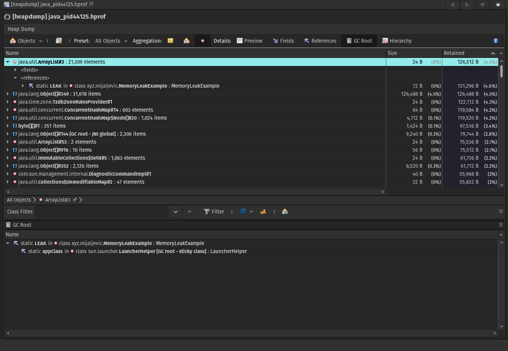

# Memory Leak Example - Diagnosing a Running JVM

This research is primarily done to learn ways to diagnose memory leaks on
running JVM instances. I will tackle this with the most commonly used tool
which is *VisualVM*.

Note that the document is probably not in a complete state since I am still
researching what and how to address memory leaks and issues.

## VisualVM

VisualVM is a free and open source tool that provides a visual interface for
viewing detailed information about Java technology-based applications (Java
applications) while they are running on a Java Virtual Machine (JVM).

VisualVM organizes data about the JVM software that is retrieved by the Java
Development Kit (JDK) tools and presents the information in a way that enables
you to quickly view data on multiple Java applications. You can view data on
local applications and applications that are running on remote hosts. You can
also capture data about JVM software instances and save the data to your local
system, and view the data later or share the data with others.

More on VisualVM can be found on their [site](https://visualvm.github.io/).

## Memory Leak

A Memory Leak is a situation where there are objects present in the heap that
are no longer used, but the garbage collector is unable to remove them from
memory, and therefore, they’re unnecessarily maintained. If not dealt with, the
application will eventually exhaust its resources, finally terminating with a
fatal `java.lang.OutOfMemoryError`.

Memory leaks can occur due to a multitude of reasons. For example static Lists
which (since they are static) never get dereferenced and keep increasing
elements, unless of course you dereference them by setting them as null
(destroying) them. Other common leak sources:

- Unclosed resources (streams, connections)
- Long-lived objects with references to short-lived ones
- *ThreadLocal* variables not properly cleaned
- Listener/observer registrations not removed

Checking for a memory leak can be done by browsing a heap dump. Either live when
the leak occurs rapidly or slowly over a period of time if the leak occurs
incrementally (which is the worst thing you can have, due to the amount of time
you have to waste to detect it).

## Heap Dumps

A heap dump is a snapshot of all the objects in the Java Virtual Machine (JVM)
heap at a certain point in time. The JVM software allocates memory for objects
from the heap for all class instances and arrays.

The garbage collector reclaims the heap memory when an object is no longer
needed and there are no references to the object. By examining the heap you can
locate where objects are created and find the references to those objects in
the source.

You can use VisualVM to browse the contents of a heap dump file and quickly see
the allocated objects in the heap.

While trying to diagnose a memory leak it is wise to include these JVM
arguments when starting the application:

```shell
-XX:+HeapDumpOnOutOfMemoryError
-XX:HeapDumpPath=/path/to/dumps
-verbose:gc
-Xloggc:gc_%t.log
```

***Parameters explained:***

- `-XX:+HeapDumpOnOutOfMemoryError` Automatically generates a heap dump when an
  `java.lang.OutOfMemoryError` exception occurs. This is invaluable because you
  capture the exact state that caused the failure.
- `-XX:HeapDumpPath=/path/to/dumps` Specifies where heap dumps should be saved.
  Use an absolute path with sufficient disk space (heap dumps can be large)
- `-verbose:gc` Enables basic garbage collection logging to standard output.
  Shows when collections occur and how long they take. Helps identify if GC is
  running frequently but unable to reclaim memory.
- `-Xlog:gc:gc_%t.log` Directs GC logs to a specific file instead of STDOUT.
  Using the `%t` we avid new logs overwriting old ones.

Lastly in heap dumps you may come across *dominator trees*. These are extremely
useful when detecting a memory leak. In memory analysis, object A "dominates"
object B if all paths from the GC roots to B must pass through A. This means:

- If A were removed, B would become unreachable and eligible for garbage
  collection
- A "dominates" all objects that would be collected if A were removed

The dominator tree organizes objects hierarchically based on this relationship,
making it easier to see which objects are responsible for keeping large
portions of memory alive. They help identify:

- **Memory leak sources** - Objects at higher levels of the tree that maintain
  references to unexpected amounts of memory
- **Retention chains** - The exact path of references keeping objects alive
- **Dominated size** - The total memory an object is responsible for keeping
  alive (not just its own size)

An example pattern (deduced from a dominator tree):

1. A collection object (like `HashMap`) might appear high in the tree
2. It dominates a large number of objects that should have been released
3. Following its references reveals which code is adding to the collection
   without removing items

## Detecting irregularities

Once you have your heap dump it is time to detect the irregularities. To check
for irregularities you first need to know how your application should operate
when there are none. For example what is the appropriate number of loaded
instances for the low and peek hours.

Once you know what your normal base of operations is you can start to look for
irregularities. If you for example have total of 32k `String` instances during
low hours and currently VisualVM is displaying 50k there could be a potential
issue that was introduced in the latest patch/version of your software.

In cases when memory slowly increases the best thing is to take application
snapshots and heap dumps every X amount of time. That can be hours/day/weeks.
But usually it is either every 4/8/12 hours or once a day. After a couple of
snapshots you can start to check for what is increasing above what you would
consider an appropriate amount (the base).

If you run the Memory Leak Example project and activate the VisualVM monitoring
tool you may observe the LEAK list slowly increasing in size. Take a heap dump
every 30 minutes, and you will see that the number of retained `String`
instances inside the `ArrayList` is steadily growing. This is one of the more
common occurrences that produce memory leaks.

After you try the application without hard limits for the JVM it is time to
force a `java.lang.OutOfMemoryError`, therefore run the application with these
parameters:

```shell
java -jar -Xms3m -Xmx3m \
	-XX:+HeapDumpOnOutOfMemoryError \
	-XX:HeapDumpPath=./dumps \
	-verbose:gc \
	-Xlog:gc:./gc-logs/gc_%t.log \
	memory-leak-example-1.0-SNAPSHOT.jar
```

This will induce a `java.lang.OutOfMemoryError` at 3Mb of heap space and
generate the heap dump which you can then read using VisualVM. After some time
a heap dump will occur (if you try to attach a profiler while the app is
running you will get one even sooner). In the image bellow you can observe the
dump that was produced by the `OutOfMemoryError` exception.


